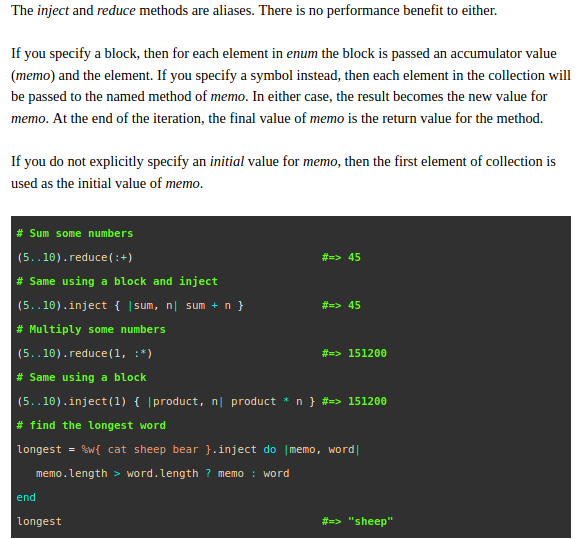

# Ruby Enumerables

In this short project, I created my own versions of the following Enumerable methods with a "my_" prefix:

- each
- each_with_index
- select
- all?
- any?
- none?
- count
- map
- inject

Made use of conditionals, loops, enums, blocks, yield and procs.

## Example Method Screenshot

## Built With
- Ruby

## Deployment

This code can be deployed on any Ruby IDE or code editor by cloning the repository from this [link](https://github.com/anewman15/ruby-enumerables/tree/custom_enumerables)

After cloning it:
1. Open the my_enumerables.rb file and see which methods are available.
2. Find the original methods in [Ruby Docs page](https://ruby-doc.org/core-2.7.1/). Take note of the use cases for each method. You can use them in step 4.
3. Create a test.rb file to test the methods and see if they return the same output as their original Ruby Enumerable counterparts. Add "require_relative 'my_enumerables'" and "include Enumerable" as the first two lines.
4. Use the test cases for each of the original methods(from step 2) to test and compare the output with their "my_" prefixed versions. They should return the same value.
5. If they don't, please feel free to open an issue and let me know about them.

## Live Demo
[Repl.it Demo Link](https://repl.it/@anewman15/Custom-Ruby-Enumerable-Methods). Navigate to the my_enumerables.rb file to see what methods are available. Then go to the main.rb file, uncomment/add a test case and cick the "run" button to test the method.

## Authors
👤 **Abdullah Numan**
- Github: [@anewman15](https://github.com/anewman15)
- Twitter: [@aanuman15](https://twitter.com/aanuman15)
- Linkedin: [aanuman15](https://www.linkedin.com/in/aanuman15/)

## 🤝 Contributing
Contributions, issues and feature requests are welcome!
Feel free to check the [issues page](https://github.com/anewman15/ruby-enumerables/issues).

## Show your support
Give a ⭐️ if you like this project!

## Acknowledgments
- https://www.theodinproject.com/
- https://ruby-doc.org/
- https://skorks.com/